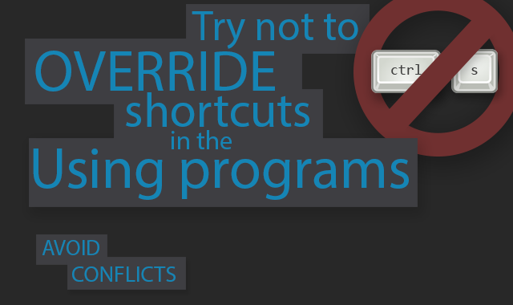

Vestbi
======

Versatile Stuff Binder - small fancy wpf tray app to shortcut various stuff.
It can make life much easier if you are spending a lot of time text editing, text reading, text making, etc.

Latest version distributive always available on [sourceforge](http://sourceforge.net/projects/vestbi/files/latest/download)

Features
-----
* <strong>Run any command line.</strong> Say you have a batch file to make some manipulations with text. Just select text you want and press assigned shortcut to execute command line with selected text, get results (option) and paste it into previous selection (option). Its not necessary to select text - popup editor will appear to input text. You can just run any program without any text!
* <strong>Open browser</strong> with selected text. Text can be a part of more complex preset request. By default - it just asks Google with the text you selected.
* <strong>Append to file.</strong> If you are collecting wisdom, or making lyrics, or saving code snippets - just select text you want and press shortcut! It also can insert timestamps and delimiters between text blocks.
* <strong>Translate.</strong> Open built-in browser with request to Google Translate with selected text and selected source and destination languages.
* <strong>Regex.</strong> Search and replace through text using regular expressions.
* <strong>Script.</strong> Make your own method of text manipulation! With C# everything is possible!

some pics from built-in guide

Mechanics
-----
* Get hotkeys using [Ciantic's KeyboardListener](https://gist.github.com/Ciantic/471698)
* Assign hotkeys using pinvoke RegisterHotKey
* Backup previous clipboard data using Windows.Clipboard
* Send CTRL+C to currently active application using reverse-engineered Windows.Forms.SendInput (original doesn't work with non-latin keyboards)
* Get text from clipboard. Make manipulations with it.
* Push results into clipboard and send CTRL+V to the currently active application
* Restore previous clipboard data

other:
* Used pinvoke FindWindow and SendMessage and WndProc hook to make application single instance
* Used registry to make application autorun with windows
* Used lots of pinvoke to make popup window topmost, active and focus-intercepting

License
-----
GPL. Used libraries distributed under their licenses.

Used libraries
-----
* [Mahapps.Metro](https://github.com/MahApps/MahApps.Metro)
* [ICSharpCode.AvalonEdit] (https://github.com/icsharpcode/SharpDevelop/wiki/AvalonEdit)
